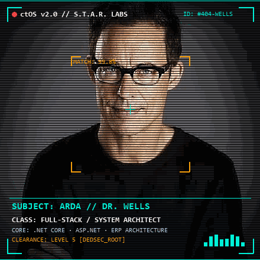

<div align="center">

  <!-- S.T.A.R. Labs Vector Header with Matrix Rain -->
  <a href="https://github.com/HarrisonWellsRUNBarryRUN">
    
  </a>

  <br /><br />

  <!-- Animated Harrison Wells ctOS Profiler -->
  <a href="https://github.com/HarrisonWellsRUNBarryRUN">
    
  </a>

  <br /><br />

  <!-- Live Typing Terminal Animation -->
  

  <br />

  <!-- Action Badges -->
  <p>
    <a href="https://ardaportfoy.onrender.com/">
      
    </a>
    <a href="https://www.linkedin.com/in/arda-a-020bb5380/">
      
    </a>
    <a href="https://github.com/HarrisonWellsRUNBarryRUN">
      
    </a>
    <a href="mailto:ardaagar2035@outlook.com.tr">
      
    </a>
  </p>

</div>

<p align="center">
  
</p>

```yaml
┌──[ S.T.A.R. LABS // ctOS BIOMETRIC TELEMETRY ]─────────────────────────────────────────┐
│ SUBJECT    : Arda A. (@drharrisonwells) • LEVEL 5 [ROOT] • 0 Vulnerabilities Detected  │
│ DOMAIN     : Enterprise ERP • ASP.NET Core • High-Throughput • Sub-Millisecond Pipelines│
│ TACHYON    : 9.84 GHz Event Stream • "Run, Barry, RUN. My goals are beyond ordinary."  │
└────────────────────────────────────────────────────────────────────────────────────────┘
```

<p align="center">
  
</p>

## ⚡ Tech Stack & Core Runtime

### 🔹 Backend & High-Throughput Services


### 🔹 Network Protocols, Gateways & Messaging


### 🔹 Mobile Client & Modern Frontend


### 🔹 Databases & In-Memory Engines


### 🔹 Tools, Containers & Environment


<p align="center">
  
</p>

## 🎯 Primary Directives & Enterprise Focus

<table>
  <tr>
    <td width="33%" valign="top">
      <h4 align="center">🏢 Enterprise ERP</h4>
      <p align="center"><code>STATUS: PRODUCTION</code></p>
      <ul>
        <li>Multi-tenant business domain logic &amp; workflows</li>
        <li>Granular Role-Based Access Control (RBAC)</li>
        <li>ACID compliance &amp; transactional integrity</li>
      </ul>
    </td>
    <td width="33%" valign="top">
      <h4 align="center">⚡ High-Throughput</h4>
      <p align="center"><code>STATUS: SUB-10MS</code></p>
      <ul>
        <li>Clean Architecture in .NET 8 / ASP.NET Core</li>
        <li>Distributed message brokers (Kafka, RabbitMQ)</li>
        <li>Native Android (Kotlin, Jetpack Compose)</li>
      </ul>
    </td>
    <td width="33%" valign="top">
      <h4 align="center">🛡️ Low-Level &amp; Security</h4>
      <p align="center"><code>STATUS: ZERO-EXPLOIT</code></p>
      <ul>
        <li>MTA:SA Lua authoritative server state machines</li>
        <li>Strict server-side validation &amp; anti-spoofing</li>
        <li>Sub-millisecond memory caching &amp; profiling</li>
      </ul>
    </td>
  </tr>
</table>

<p align="center">
  
</p>

## 📊 ctOS Network Telemetry & GitHub Highlights

<div align="center">
  
  <br /><br />
  
  
</div>

<p align="center">
  
</p>

<div align="center">
  <sub>ctOS v2.0 • S.T.A.R. Labs Central Core • <i>"Run, Barry, RUN."</i> • Maintained by <b>Arda A.</b></sub>
</div>
